# ETL Router Architecture

This document describes the architecture of the ETL Router system, a distributed data routing platform for building ETL pipelines.

## System Overview

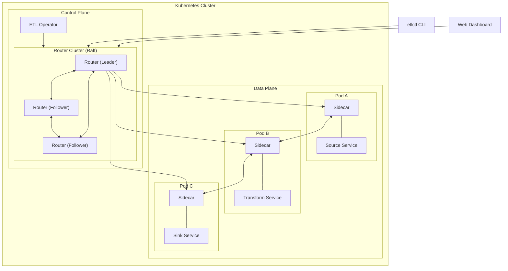

## Core Components

### Component Hierarchy

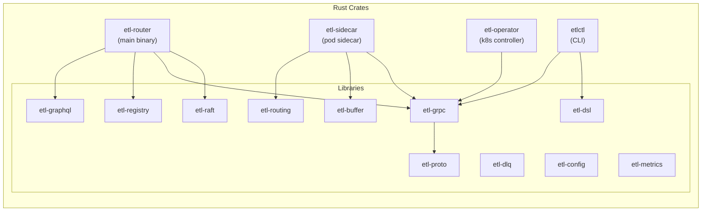

## Router Cluster

The router cluster is the central control plane, providing service registry, pipeline management, and sidecar coordination. It uses Raft consensus for high availability.

### Raft State Machine

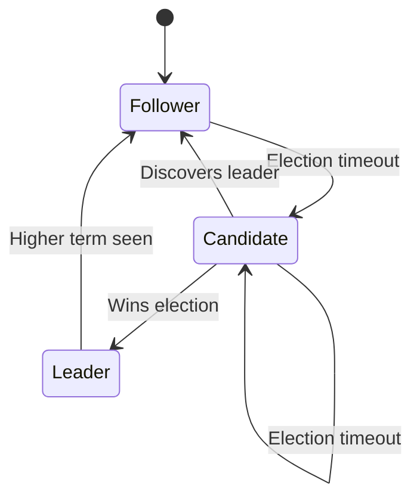

### Raft Log Replication

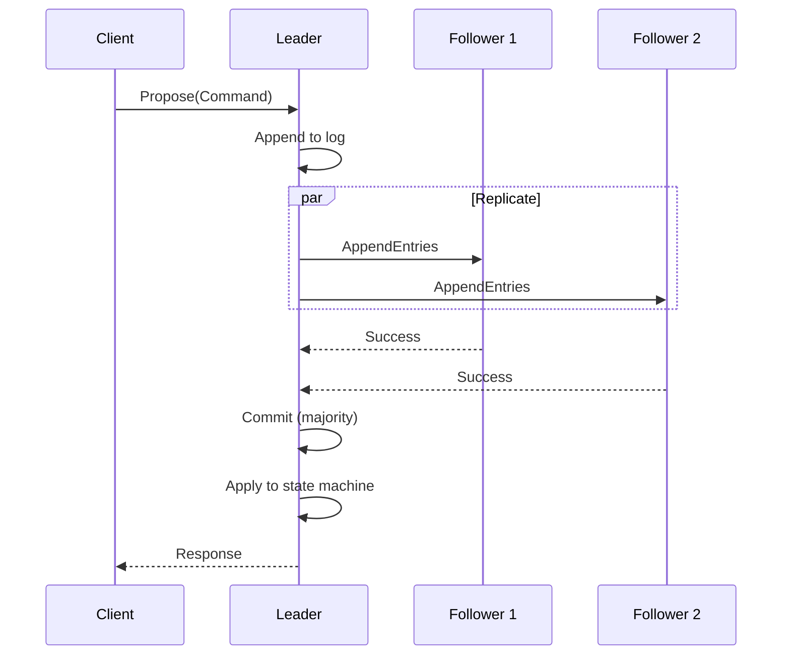

### State Machine Commands

The Raft state machine processes these commands:

| Command | Description |
|---------|-------------|
| `RegisterService` | Register a source/transform/sink service |
| `DeregisterService` | Remove a service from registry |
| `RegisterSidecar` | Register a sidecar with its local services |
| `DeregisterSidecar` | Remove a sidecar (pod terminated) |
| `AssignPipeline` | Assign pipeline stages to a sidecar |
| `RevokePipeline` | Revoke pipeline assignment from sidecar |

## Sidecar Architecture

Each application pod runs a sidecar that handles service discovery, routing, and data flow.

### Sidecar Components

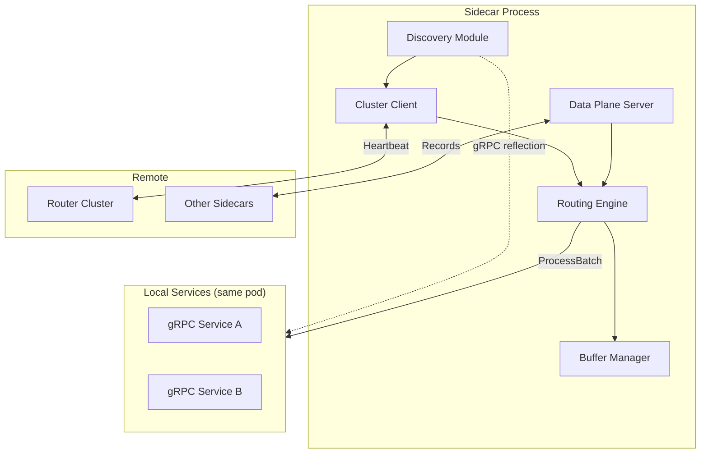

### Sidecar Lifecycle

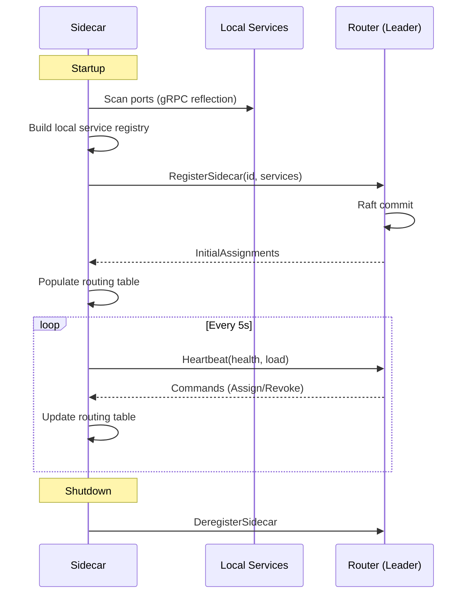

### Routing Table Structure

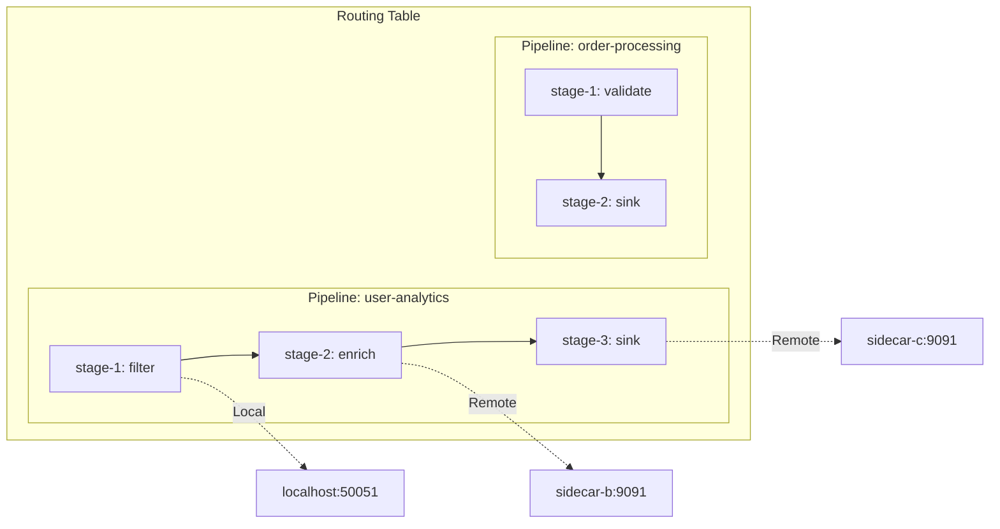

## Data Flow

### Record Processing Pipeline

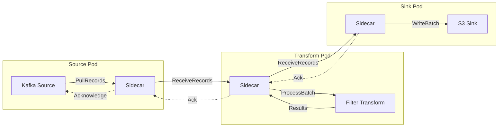

### Backpressure Flow

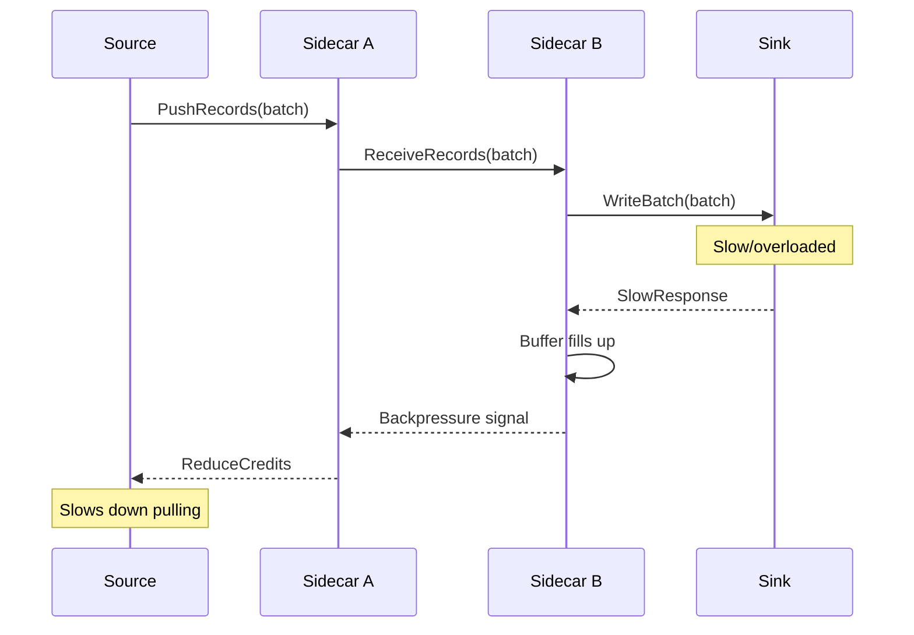

## Pipeline Optimization

The DSL optimizer merges shared pipeline prefixes to avoid redundant processing.

### Before Optimization

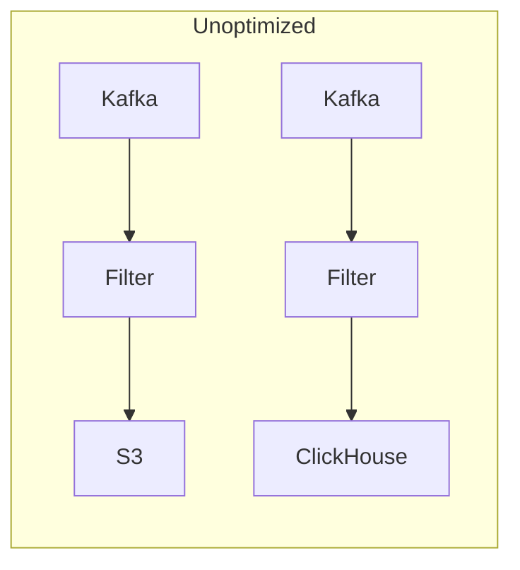

### After Optimization

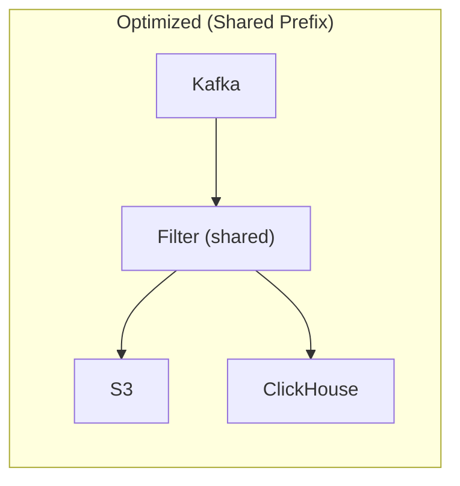

## Kubernetes Integration

### Custom Resource Definitions

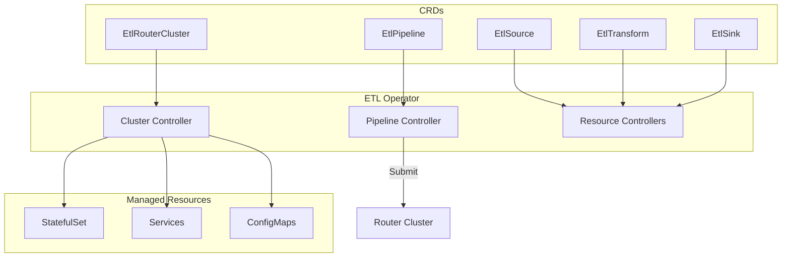

### Operator Reconciliation

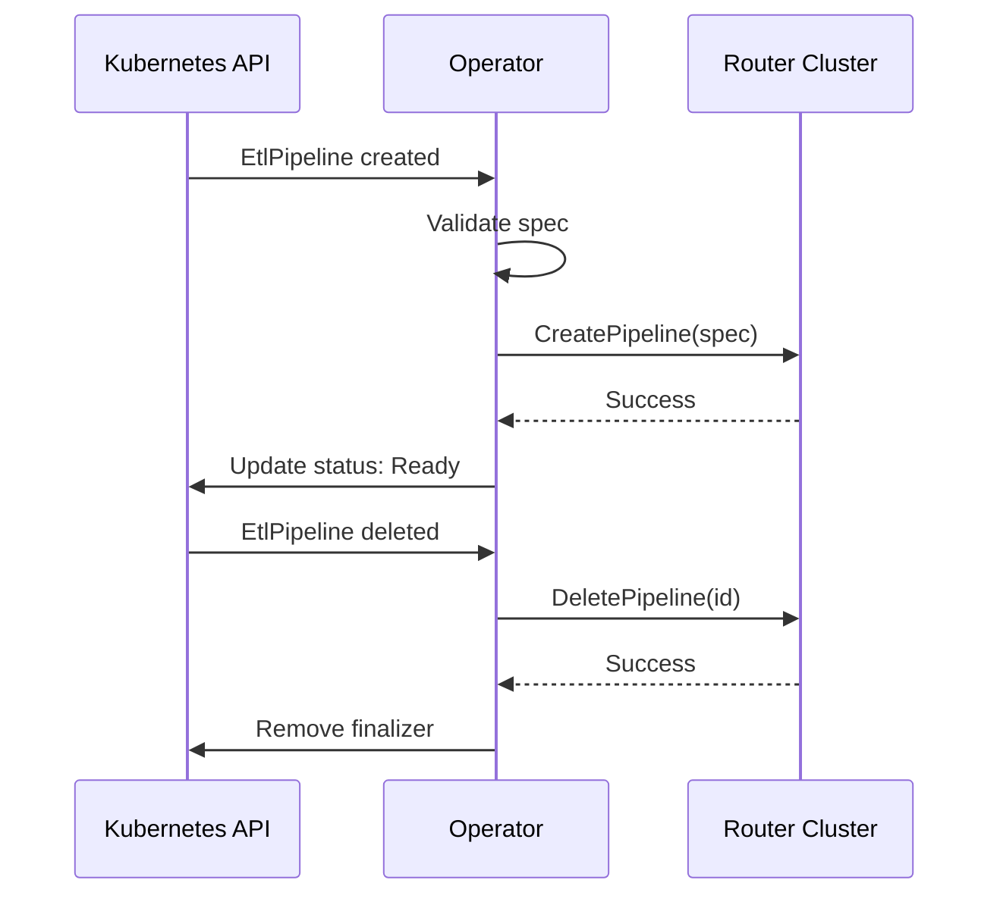

## Protocol Overview

### gRPC Services

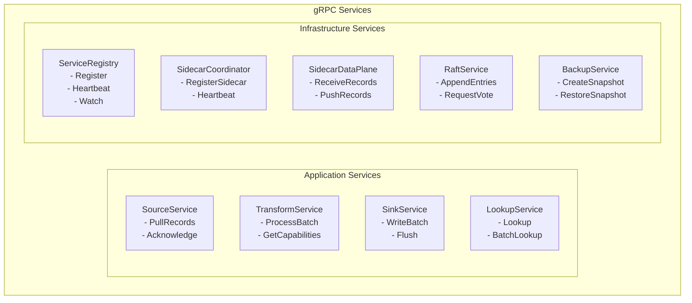

## Deployment Architecture

### Production Deployment

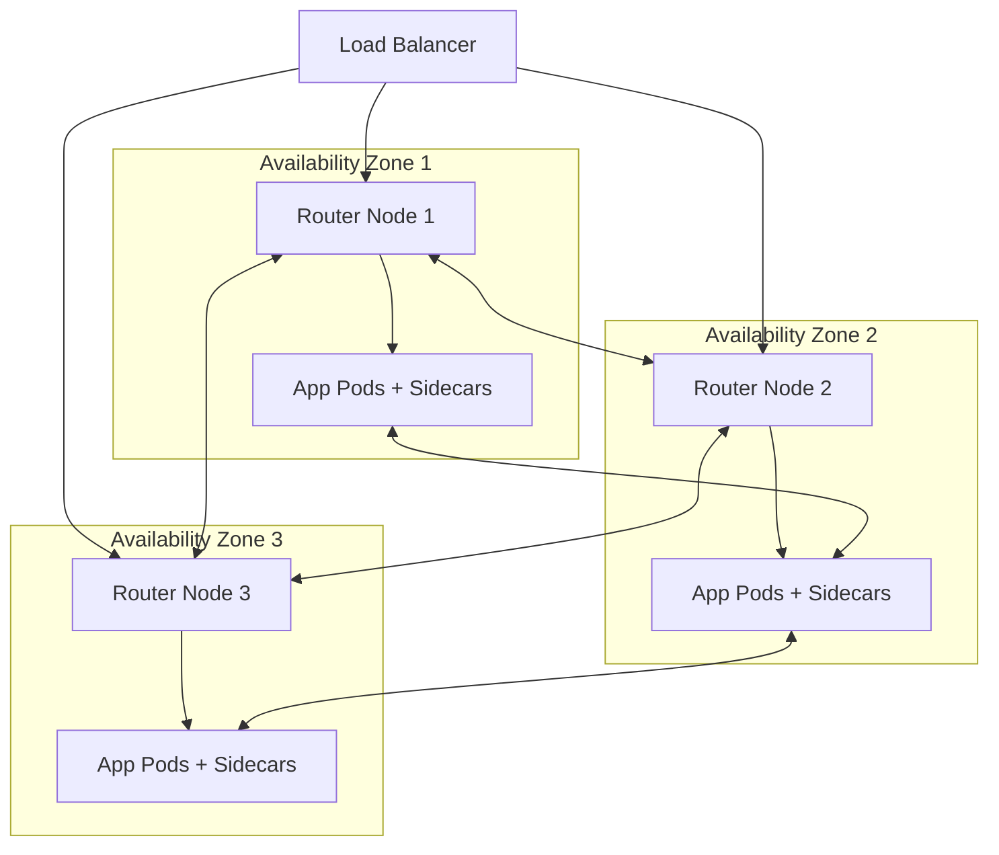

## Crate Descriptions

| Crate | Purpose |
|-------|---------|
| `etl-router` | Main router binary, orchestrates all components |
| `etl-sidecar` | Sidecar binary for pod deployment |
| `etl-operator` | Kubernetes operator for CRD management |
| `etlctl` | CLI tool for pipeline management |
| `etl-raft` | Raft consensus implementation |
| `etl-grpc` | gRPC server implementations |
| `etl-proto` | Protocol buffer definitions |
| `etl-registry` | Service registry logic |
| `etl-routing` | Record routing and watermarks |
| `etl-dsl` | Pipeline DSL parsing and optimization |
| `etl-buffer` | Record buffering with backpressure |
| `etl-dlq` | Dead letter queue handling |
| `etl-config` | Configuration management |
| `etl-metrics` | Prometheus metrics |
| `etl-graphql` | GraphQL API for dashboard |

## Design Principles

1. **Sidecar Pattern**: Routing logic is decoupled from application code. Services implement simple gRPC interfaces; the sidecar handles discovery and routing.

2. **Raft for Consistency**: Pipeline assignments must be consistent across the cluster. Raft ensures all nodes agree on state.

3. **Pull-Based with Backpressure**: Sources pull at a rate the pipeline can handle. Backpressure propagates upstream to prevent unbounded queuing.

4. **Shared Stage Optimization**: Pipelines from the same source with common prefixes share processing, reducing redundant work.

5. **Kubernetes Native**: Full integration with Kubernetes via CRDs and operators. Familiar patterns for k8s users.

6. **Observability Built-in**: Prometheus metrics, distributed tracing hooks, and a real-time dashboard.
