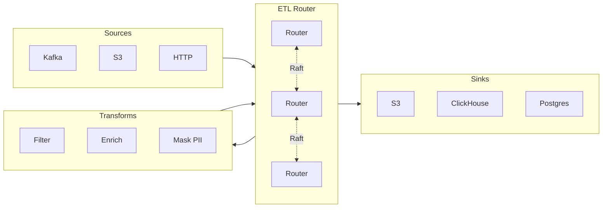
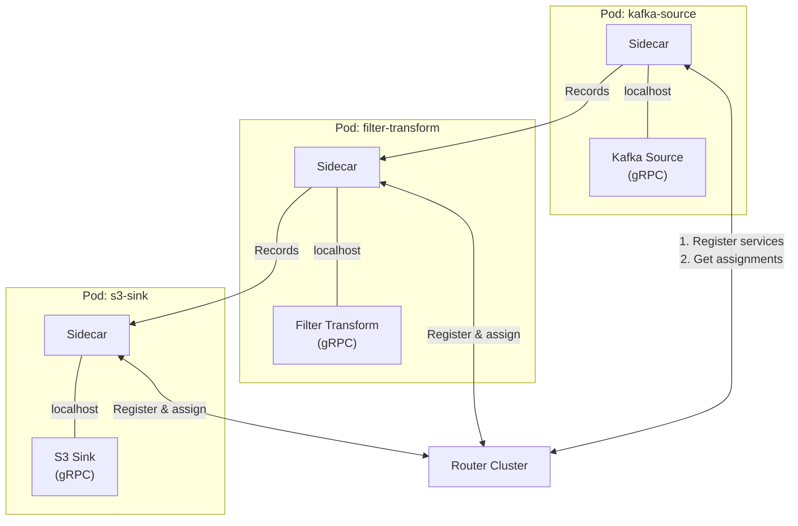
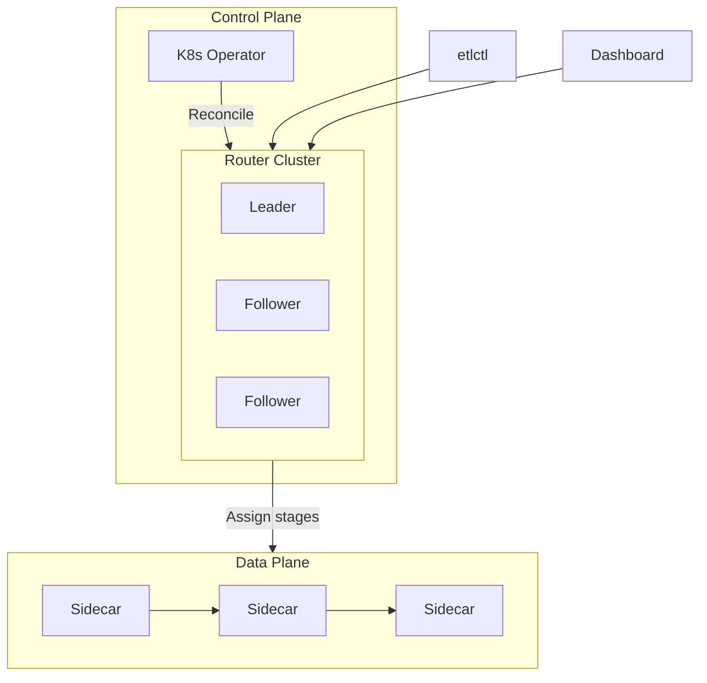

# ETL Router

A distributed, high-availability ETL routing platform built in Rust. Route data through pipelines of sources, transforms, and sinks with automatic service discovery, backpressure handling, and Kubernetes-native deployment.

## What is ETL Router?

ETL Router is a **control plane** for data pipelines. Instead of hardcoding connections between your data services, you define pipelines declaratively and ETL Router handles:

- **Service Discovery** - Automatically finds and registers your gRPC services
- **Routing** - Routes records through pipeline stages across pods
- **Backpressure** - Prevents overload by propagating flow control upstream
- **High Availability** - Raft consensus ensures no single point of failure
- **Kubernetes Native** - Deploy with CRDs and manage with `kubectl`



## Key Features

| Feature | Description |
|---------|-------------|
| **Sidecar Architecture** | Deploy a sidecar in each pod - it discovers local services and handles routing |
| **Raft Consensus** | 3+ node cluster with automatic leader election and failover |
| **Pipeline DSL** | Define pipelines in YAML with fan-in, fan-out, and shared stages |
| **Backpressure** | Credit-based flow control prevents unbounded memory growth |
| **Dead Letter Queue** | Failed records are captured with full error context for replay |
| **Kubernetes Operator** | CRDs for `EtlPipeline`, `EtlSource`, `EtlTransform`, `EtlSink` |
| **Web Dashboard** | Real-time monitoring, pipeline visualization, error inspection |
| **CLI Tool** | `etlctl` for pipeline management, backup/restore, debugging |

## How It Works



1. **Sidecars register** with the router cluster, reporting their local services
2. **Router assigns pipeline stages** to sidecars based on what services they have
3. **Records flow** directly between sidecars (data plane), not through the router
4. **Backpressure propagates** upstream when any stage is slow

## Quick Start

### Prerequisites

- Rust 1.75+
- Docker (for Kubernetes deployment)
- Node.js 20+ (for web dashboard)

### Run Locally

```bash
# Start the router
cargo run -p etl-router

# In another terminal, start a sidecar
cargo run -p etl-sidecar

# Use the CLI
cargo run -p etlctl -- get pipelines
```

### Deploy to Kubernetes

```bash
# Install CRDs and operator
kubectl apply -f crates/etl-operator/deploy/crds/crds.yaml
kubectl apply -k crates/etl-operator/deploy/operator/

# Create a cluster
kubectl apply -f - <<EOF
apiVersion: etl.router/v1
kind: EtlRouterCluster
metadata:
  name: my-cluster
spec:
  replicas: 3
EOF

# Create a pipeline
kubectl apply -f - <<EOF
apiVersion: etl.router/v1
kind: EtlPipeline
metadata:
  name: user-analytics
spec:
  source: kafka-users
  steps:
    - filter-active
    - mask-pii
  sink: clickhouse-analytics
EOF
```

### Use the CLI

```bash
# Apply manifests
etlctl apply -f pipelines/

# List resources
etlctl get pipelines
etlctl get sources --all-namespaces

# Visualize pipeline DAG
etlctl graph -f pipelines/ --format dot | dot -Tpng > pipeline.png

# Backup cluster state
etlctl backup create --dest s3://my-bucket/backups/

# Restore from backup
etlctl backup restore abc123 --source s3://my-bucket/backups/
```

## Pipeline Definition

Define pipelines using simple YAML manifests:

```yaml
# source.yaml
apiVersion: etl.router/v1
kind: Source
metadata:
  name: kafka-users
  namespace: default
spec:
  grpc:
    endpoint: kafka-source-svc:50051

# transform.yaml
apiVersion: etl.router/v1
kind: Transform
metadata:
  name: filter-active
spec:
  grpc:
    endpoint: filter-svc:50051

# pipeline.yaml
apiVersion: etl.router/v1
kind: Pipeline
metadata:
  name: user-analytics
spec:
  source: kafka-users
  steps:
    - filter-active
    - enrich-geo
  sink: clickhouse-analytics
  dlq:
    enabled: true
    maxRetries: 3
```

## Architecture Overview



For detailed architecture documentation, see [ARCHITECTURE.md](ARCHITECTURE.md).

## Project Structure

```
etl-router/
├── crates/
│   ├── etl-router/      # Main router binary
│   ├── etl-sidecar/     # Pod sidecar binary
│   ├── etl-operator/    # Kubernetes operator
│   ├── etlctl/          # CLI tool
│   ├── etl-raft/        # Raft consensus
│   ├── etl-grpc/        # gRPC handlers
│   ├── etl-proto/       # Protocol buffers
│   ├── etl-registry/    # Service registry
│   ├── etl-routing/     # Routing engine
│   ├── etl-dsl/         # Pipeline DSL
│   ├── etl-buffer/      # Backpressure buffers
│   ├── etl-dlq/         # Dead letter queue
│   ├── etl-config/      # Configuration
│   ├── etl-metrics/     # Prometheus metrics
│   └── etl-graphql/     # GraphQL API
└── web/                 # SvelteKit dashboard
```

## Configuration

### Router Environment Variables

| Variable | Description | Default |
|----------|-------------|---------|
| `GRPC_PORT` | gRPC server port | `50051` |
| `GRAPHQL_PORT` | GraphQL/HTTP port | `8080` |
| `RAFT_NODE_ID` | Unique node identifier | `1` |
| `RAFT_PEERS` | Comma-separated peer addresses | - |
| `DATA_DIR` | Persistent storage path | `./data` |

### Sidecar Environment Variables

| Variable | Description | Default |
|----------|-------------|---------|
| `SIDECAR_ID` | Unique sidecar identifier | auto-generated |
| `CLUSTER_ENDPOINT` | Router cluster address | `etl-router:50051` |
| `GRPC_PORT` | Sidecar gRPC port | `9091` |
| `DISCOVERY_PORTS` | Ports to scan for services | `50051-50060` |

## Web Dashboard

The web dashboard provides real-time visibility into your ETL pipelines:

```bash
cd web
npm install
npm run dev
# Open http://localhost:5173
```

Features:
- **Cluster Status** - Node health, leader info, Raft state
- **Pipeline Topology** - Interactive DAG visualization
- **Metrics** - Throughput, latency, backpressure indicators
- **Error Inspector** - View DLQ records, retry failed batches

## API Reference

### GraphQL

```graphql
query {
  clusterStatus {
    nodes { id role healthy }
    leader
  }

  pipelines {
    id
    source
    stages { id endpoint }
    sink
  }
}

mutation {
  createPipeline(input: {
    name: "my-pipeline"
    source: "kafka-events"
    steps: ["filter", "enrich"]
    sink: "s3-archive"
  }) {
    success
    pipelineId
  }
}
```

### gRPC

Protocol definitions in `crates/etl-proto/proto/`:

| Proto | Services |
|-------|----------|
| `source.proto` | `SourceService` - Pull records from sources |
| `transform.proto` | `TransformService` - Process record batches |
| `sink.proto` | `SinkService` - Write records to destinations |
| `registry.proto` | `ServiceRegistry` - Register/discover services |
| `sidecar.proto` | `SidecarCoordinator`, `SidecarDataPlane` |
| `raft.proto` | `RaftService` - Consensus protocol |

## Testing

```bash
# Run all tests
cargo nextest run

# Run specific crate tests
cargo nextest run -p etl-raft

# Run with logging
RUST_LOG=debug cargo nextest run
```

## Contributing

Contributions are welcome! Please read our contributing guidelines and submit PRs to the `main` branch.

## License

Licensed under either of:

- Apache License, Version 2.0 ([LICENSE-APACHE](LICENSE-APACHE))
- MIT license ([LICENSE-MIT](LICENSE-MIT))

at your option.

Copyright (c) 2025 Alex Choi
